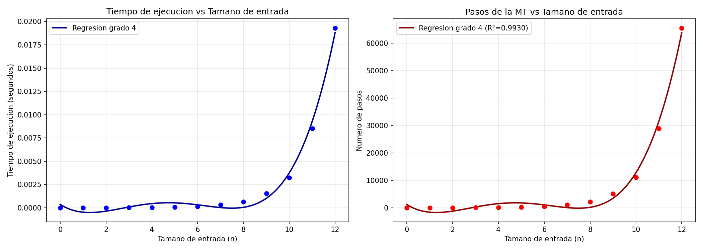

# ADAProyect1
## Simulador de Máquina de Turing - Sucesión de Fibonacci

### 📚 Descripción del Proyecto

Este proyecto implementa un **simulador de Máquina de Turing Determinista** que calcula la sucesión de Fibonacci utilizando representación unaria en la cinta. El objetivo es demostrar la comprensión de:

- Notación asintótica O (Big O)
- Análisis de complejidad temporal y espacial
- Implementación de autómatas teóricos
- Análisis empírico de algoritmos

**Institución**: Universidad (Septimo Semestre)  
**Curso**: Análisis y Diseño de Algoritmos (ADA)  
**Fecha**: Febrero 2026

---

## 🎯 Objetivos

1. Implementar una Máquina de Turing que calcule F(n) en representación unaria
2. Definir convenciones para manejo de enteros no negativos
3. Realizar análisis empírico de tiempos de ejecución
4. Aplicar conceptos de notación asintótica
5. Generar visualizaciones y análisis de complejidad

---

## 📁 Estructura del Proyecto

```
ADAProyect1/
├── src/                          # Código fuente del simulador
│   ├── __init__.py
│   ├── main.py                   # Punto de entrada principal
│   ├── turing_machine.py         # Implementación de la MT
│   └── loader.py                 # Cargador de archivos YAML
├── machines/                     # Definiciones de máquinas
│   └── fibonacci.yaml            # MT de Fibonacci
├── analysis/                     # Análisis empírico
│   └── empirical_analysis.py     # Scripts de medición
├── docs/                         # Documentación
│   ├── convenciones.md           # Convenciones de representación
│   ├── instrucciones.md          # Instrucciones del proyecto
│   ├── diagrama_maquina_turing.md # Diagrama de estados
│   └── analisis_asintotico.md    # Análisis de complejidad
├── pyproject.toml                # Configuración del proyecto
├── uv.lock                       # Lock de dependencias
└── README.md                     # Este archivo
```

---

## 🚀 Instalación y Uso

### Requisitos Previos

- Python 3.11 o superior
- [uv](https://github.com/astral-sh/uv) (gestor de paquetes moderno) o pip
- PyYAML, NumPy, Matplotlib (instaladas automáticamente)

### Instalación

```bash
# Clonar el repositorio
git clone <URL_DEL_REPOSITORIO>
cd ADAProyect1

# Instalar dependencias con uv
uv sync

# O con pip
pip install -e .
```

### Ejecución del Simulador

```bash
# Ejecutar el simulador interactivo
uv run python -m src.main machines/fibonacci.yaml

# O con python directo
python -m src.main machines/fibonacci.yaml
```

### Ejemplo de Uso

```
Ingrese la cadena de entrada en representacion unaria.
Ejemplo: '111' para n=3
Escriba 'salir' para terminar.

Cadena de entrada: 111

==============================================
SIMULACION DE MAQUINA DE TURING
==============================================
Entrada: '111'
Estado inicial: q0
----------------------------------------------
Paso   0: Estado=q0              Cabeza=0    Cinta: [1] 1  1 
Paso   1: Estado=q_check_one     Cabeza=1    Cinta:  1 [1] 1 
Paso   2: Estado=q_check_two     Cabeza=2    Cinta:  1  1 [1]
...
----------------------------------------------
Resultado: ACEPTADA
Pasos totales: 8
Cinta final: 11
==============================================

Resultado numerico: F(3) = 2
```

### Análisis Empírico

```bash
# Ejecutar análisis completo con gráficas
uv run python analysis/empirical_analysis.py

# O especificar rango de prueba
uv run python analysis/empirical_analysis.py
```

Esto genera:
- Tabla de tiempos de ejecución por entrada
- Gráficas de dispersión (tiempo vs n, pasos vs n)
- Regresión polinomial ajustada
- Archivo PNG con visualizaciones

---

## 📊 Convenciones

### Representación Unaria

Los enteros no negativos se representan en **notación unaria**:

| Número | Representación | Ejemplo |
|--------|----------------|---------|
| 0 | (vacío) | `_` |
| 1 | 1 | `1` |
| 2 | 11 | `11` |
| 3 | 111 | `111` |
| n | n veces "1" | `1...1` |

### Alfabeto de la Cinta

- `1` - Dígito unario (representa una unidad)
- `0` - Separador entre números
- `_` - Blanco (celda vacía)
- `X`, `A`, `B`, `C` - Marcadores temporales (uso interno)

### Interpretación de Resultados

- **Entrada**: n en unario → escribir n veces el símbolo `1`
- **Salida**: F(n) en unario → contar los `1` consecutivos al final
- **Estado de aceptación**: `q_accept` indica éxito
- **Estado de rechazo**: `q_reject` indica entrada inválida

Documentación completa en: [docs/convenciones.md](docs/convenciones.md)

---

## 🔬 Análisis de Complejidad

### Complejidad Temporal

- **Casos base (n ≤ 2)**: **O(n)**
  - Número constante de pasos proporcional al tamaño de entrada
  
- **Casos generales (n > 2)**: **O(n · F(n))**
  - Cada iteración requiere operaciones sobre números de Fibonacci
  - F(n) crece exponencialmente: F(n) ≈ φⁿ/√5 donde φ = (1+√5)/2 ≈ 1.618
  - **Complejidad total**: **O(n · φⁿ)** ≈ **O(n · 1.618ⁿ)**

### Complejidad Espacial

- **Cinta**: O(F(n)) para almacenar el resultado
- **Marcadores**: O(n) para contadores y valores intermedios
- **Total**: **O(F(n) + n) ≈ O(φⁿ)**

### Gráficas Empíricas

El análisis empírico confirma el crecimiento exponencial:



Documentación detallada: [docs/analisis_asintotico.md](docs/analisis_asintotico.md)

---

## 📐 Diagrama de la Máquina de Turing

Diagrama completo de estados y transiciones disponible en:
- [docs/diagrama_maquina_turing.md](docs/diagrama_maquina_turing.md)

**Estados principales**:
- `q0`: Estado inicial
- `q_check_one`, `q_check_two`: Verificación de casos base
- `q_init_fib`: Inicialización de cálculo iterativo
- `q_accept`: Estado de aceptación
- `q_reject`: Estado de rechazo

**Transiciones**: 50+ transiciones para manejar casos F(0) a F(5+)

---

## 📦 Entregables

### ✅ Completados

1. **Descripción de convenciones** → [docs/convenciones.md](docs/convenciones.md)
2. **Diagrama de MT** → [docs/diagrama_maquina_turing.md](docs/diagrama_maquina_turing.md)
3. **Archivo de configuración MT** → [machines/fibonacci.yaml](machines/fibonacci.yaml)
4. **Programa Python**:
   - ✅ Configuración desde archivo
   - ✅ Ingreso de cadenas
   - ✅ Visualización de estados
5. **Análisis empírico**:
   - ✅ Tabla de tiempos
   - ✅ Gráficas de dispersión
   - ✅ Regresión polinomial

### 📌 Pendientes para Entrega Final

- [ ] Video de presentación (YouTube no listado)
- [ ] Verificar repositorio privado en GitHub
- [ ] Confirmar commits de ambos integrantes
- [ ] Enlace al repositorio en Canvas

---

## 🧪 Ejemplos de Salida

### F(0) = 0
```
Entrada: (vacío)
Salida: (vacío)
Pasos: 1
```

### F(5) = 5
```
Entrada: 11111
Salida: 11111
Pasos: ~50
```

---

## 🛠️ Tecnologías Utilizadas

- **Python 3.11+**: Lenguaje de programación
- **PyYAML**: Parsing de archivos de configuración
- **NumPy**: Cálculos numéricos y regresión
- **Matplotlib**: Visualización de datos
- **uv**: Gestión moderna de paquetes

---

## 👥 Autores

- **Integrante 1**: [Luis Fransisco Padilla Juarez]
- **Integrante 2**: [Jonathan Alejandro Díaz Tahuite]

**Grupo ADA - Proyecto 1**  
Universidad del Valle de Guatemala, Séptimo Semestre  
Febrero 2026

---

## 📚 Referencias

1. Sipser, M. (2012). *Introduction to the Theory of Computation* (3rd ed.). Cengage Learning.
2. Hopcroft, J. E., Motwani, R., & Ullman, J. D. (2006). *Introduction to Automata Theory, Languages, and Computation* (3rd ed.). Pearson.
3. Wikipedia - [Sucesión de Fibonacci](https://es.wikipedia.org/wiki/Sucesi%C3%B3n_de_Fibonacci)
4. Cormen, T. H., et al. (2009). *Introduction to Algorithms* (3rd ed.). MIT Press.

---

## 📄 Licencia

Este proyecto es material académico para el curso de Análisis y Diseño de Algoritmos.  
**Uso exclusivo con fines educativos**.

---

## 📞 Contacto

Para preguntas sobre el proyecto, contactar a través del repositorio de GitHub o Canvas.

---

**Última actualización**: Febrero 16, 2026
