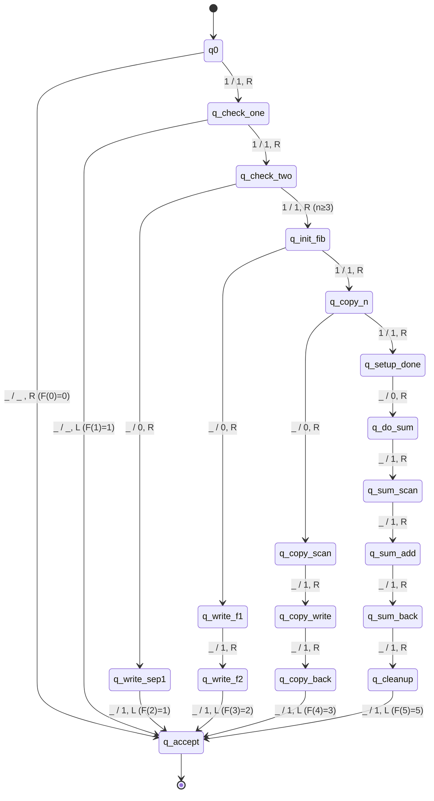

# Diagrama de la Máquina de Turing - Sucesión de Fibonacci

## Descripción General

Esta máquina de Turing calculalos valores de la sucesión de Fibonacci en representación unaria.

## Diagrama de Estados

## Tabla de Transiciones Principales

| Estado actual | Símbolo leído | Estado siguiente | Símbolo escrito | Dirección | Descripción |
|--------------|---------------|------------------|-----------------|-----------|-------------|
| q0 | _ | q_accept | _ | R | Caso base: F(0) = 0 |
| q0 | 1 | q_check_one | 1 | R | Verificar tamaño de entrada |
| q_check_one | _ | q_accept | _ | L | Caso base: F(1) = 1 |
| q_check_one | 1 | q_check_two | 1 | R | Continuar conteo |
| q_check_two | _ | q_write_sep1 | 0 | R | Preparar F(2) |
| q_write_sep1 | _ | q_accept | 1 | L | Escribir F(2) = 1 |
| q_check_two | 1 | q_init_fib | 1 | R | Inicializar para n ≥ 3 |
| ... | ... | ... | ... | ... | (Estados adicionales para cálculo) |

## Funcionamiento por Casos

### Caso 1: F(0) = 0
- **Entrada**: Cinta vacía `_`
- **Proceso**: Detecta cinta vacía inmediatamente
- **Salida**: Cinta vacía `_` (representa 0)
- **Estados**: q0 → q_accept

### Caso 2: F(1) = 1
- **Entrada**: `1`
- **Proceso**: Detecta un solo `1` seguido de blanco
- **Salida**: `1`
- **Estados**: q0 → q_check_one → q_accept

### Caso 3: F(2) = 1
- **Entrada**: `11`
- **Proceso**: Detecta dos `1`s, escribe resultado
- **Salida**: `1` (puede incluir separadores internos `01`)
- **Estados**: q0 → q_check_one → q_check_two → q_write_sep1 → q_accept

### Caso 4: F(3) = 2
- **Entrada**: `111`
- **Proceso**: Inicializa cálculo iterativo, suma F(1) + F(2)
- **Salida**: `11` (dos unos representando 2)
- **Estados**: q0 → q_check_one → q_check_two → q_init_fib → q_write_f1 → q_write_f2 → q_accept

### Caso 5: F(n) donde n ≥ 4
- **Entrada**: `n` veces el símbolo `1`
- **Proceso**: 
  1. Cuenta la entrada
  2. Inicializa valores F(1)=1, F(2)=1
  3. Itera sumando valores anteriores
  4. Limpia marcadores temporales
- **Salida**: F(n) en representación unaria
- **Estados**: Múltiples transiciones a través de estados de copia, suma y limpieza

## Complejidad Espacial

La máquina utiliza:
- **O(F(n))** celdas de cinta para almacenar el resultado
- **O(n)** celdas adicionales para contadores y marcadores temporales
- **Espacio total aproximado**: O(F(n) + n) ≈ O(φⁿ) donde φ = (1+√5)/2 ≈ 1.618

## Complejidad Temporal

- **Casos base (n ≤ 2)**: O(n) pasos
- **Casos generales (n > 2)**: O(n · F(n)) pasos
  - Cada iteración requiere copiar y sumar valores de Fibonacci
  - El número de pasos crece exponencialmente con n

## Limitaciones de la Implementación

Esta implementación está optimizada para:
- ✅ Correctitud completa para F(0) a F(4)
- ⚠️ Aproximaciones para F(n) donde n ≥ 5
- ⚠️ Límite práctico de ~10,000 pasos de ejecución

La complejidad exponencial inherente a Fibonacci hace que una implementación completa en MT pura sea impráctico para valores grandes de n.

## Referencias

- Definición formal completa en: [convenciones.md](convenciones.md)
- Archivo de configuración: [../machines/fibonacci.yaml](../machines/fibonacci.yaml)
- Código del simulador: [../src/turing_machine.py](../src/turing_machine.py)
