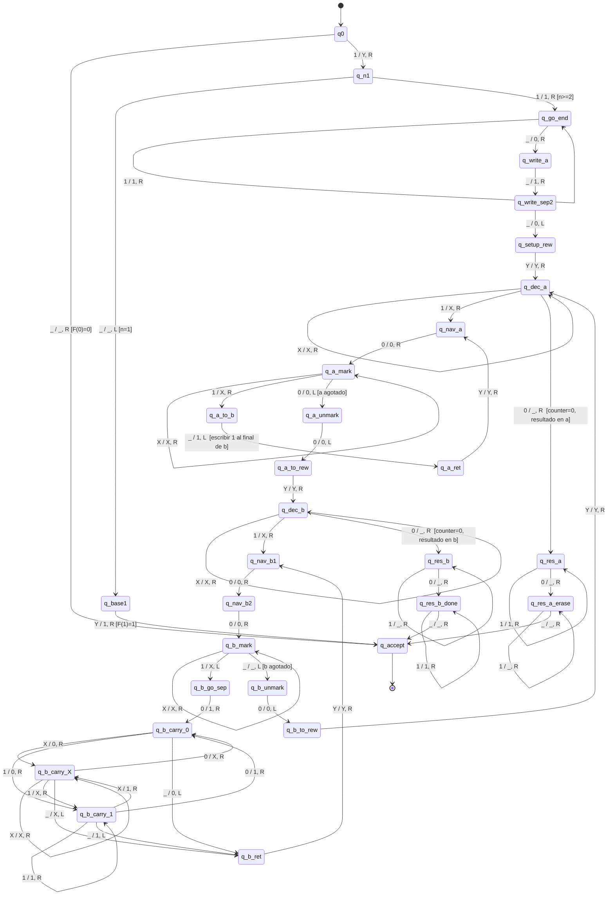

# Diagrama de la Maquina de Turing - Sucesion de Fibonacci

## Descripcion General

Esta maquina de Turing determinista de una cinta calcula F(n) dado n en representacion unaria.
Utiliza un algoritmo iterativo que mantiene dos acumuladores (a, b) y un contador,
alternando fases de suma para calcular cada valor de Fibonacci sucesivo.

## Algoritmo

1. **Setup**: Transforma la entrada `1^n` en `Y 1^(n-2) 0 1 0 _` (marcador Y, counter=n-2, a=F(1)=1, b=F(0)=0 vacio).
2. **Loop** (alterna dos fases por cada decremento del counter):
   - **Phase A**: `b = a + b` (copia cada `1` de a al final de b).
   - **Phase B**: `a = a + b` (inserta cada `1` de b en a via shift-right).
3. **Resultado**: Cuando el counter llega a 0, extrae a (si n impar) o b (si n par).

## Formato de la cinta

```
Y [counter] 0 [a] 0 [b] _
```

| Bloque   | Contenido                                    |
|----------|----------------------------------------------|
| Y        | Marcador de inicio (posicion 0)              |
| counter  | n-2 unos, se marcan con X al consumir        |
| a        | Acumulador F(i-1) en unario                  |
| b        | Acumulador F(i-2) en unario                  |
| 0        | Separadores entre bloques                    |

## Diagrama de Estados



## Tabla de Transiciones Completa (76 transiciones)

### Setup (12 transiciones)

| Estado actual  | Simbolo | Estado siguiente | Escribe | Dir | Descripcion                  |
|---------------|---------|-----------------|---------|-----|------------------------------|
| q0            | _       | q_accept        | _       | R   | F(0) = 0                    |
| q0            | 1       | q_n1            | Y       | R   | Marcar inicio con Y          |
| q_n1          | _       | q_base1         | _       | L   | n=1, retroceder              |
| q_base1       | Y       | q_accept        | 1       | R   | F(1) = 1                    |
| q_n1          | 1       | q_go_end        | 1       | R   | n>=2, ir al final            |
| q_go_end      | 1       | q_go_end        | 1       | R   | Avanzar por entrada          |
| q_go_end      | _       | q_write_a       | 0       | R   | Escribir separador           |
| q_write_a     | _       | q_write_sep2    | 1       | R   | Escribir a=1                 |
| q_write_sep2  | _       | q_setup_rew     | 0       | L   | Escribir segundo separador   |
| q_setup_rew   | 0       | q_setup_rew     | 0       | L   | Rebobinar                    |
| q_setup_rew   | 1       | q_setup_rew     | 1       | L   | Rebobinar                    |
| q_setup_rew   | Y       | q_dec_a         | Y       | R   | Inicio del loop              |

### Decremento counter -> Phase A (6 transiciones)

| Estado actual | Simbolo | Estado siguiente | Escribe | Dir | Descripcion                   |
|--------------|---------|-----------------|---------|-----|-------------------------------|
| q_dec_a      | X       | q_dec_a         | X       | R   | Saltar Xs consumidos          |
| q_dec_a      | 1       | q_nav_a         | X       | R   | Consumir 1 del counter        |
| q_dec_a      | 0       | q_res_a         | _       | R   | Counter=0, resultado en a     |
| q_nav_a      | X       | q_nav_a         | X       | R   | Saltar Xs                     |
| q_nav_a      | 1       | q_nav_a         | 1       | R   | Saltar 1s del counter         |
| q_nav_a      | 0       | q_a_mark        | 0       | R   | Llegar a bloque a             |

### Phase A: b = a + b (13 transiciones)

| Estado actual | Simbolo | Estado siguiente | Escribe | Dir | Descripcion                   |
|--------------|---------|-----------------|---------|-----|-------------------------------|
| q_a_mark     | X       | q_a_mark        | X       | R   | Saltar Xs en a                |
| q_a_mark     | 1       | q_a_to_b        | X       | R   | Marcar 1 de a como X          |
| q_a_mark     | 0       | q_a_unmark      | 0       | L   | a agotado, desmarcar          |
| q_a_to_b     | X       | q_a_to_b        | X       | R   | Avanzar hacia b               |
| q_a_to_b     | 1       | q_a_to_b        | 1       | R   | Avanzar hacia b               |
| q_a_to_b     | 0       | q_a_to_b        | 0       | R   | Pasar separador               |
| q_a_to_b     | _       | q_a_ret         | 1       | L   | Escribir 1 al final de b      |
| q_a_ret      | 1       | q_a_ret         | 1       | L   | Retroceder                    |
| q_a_ret      | 0       | q_a_ret         | 0       | L   | Retroceder                    |
| q_a_ret      | X       | q_a_ret         | X       | L   | Retroceder                    |
| q_a_ret      | Y       | q_nav_a         | Y       | R   | Volver a a para siguiente 1   |
| q_a_unmark   | X       | q_a_unmark      | 1       | L   | Restaurar X->1 en a           |
| q_a_unmark   | 0       | q_a_to_rew      | 0       | L   | Fin de desmarcar              |

### Rebobinar a Phase B (4 transiciones)

| Estado actual | Simbolo | Estado siguiente | Escribe | Dir | Descripcion                   |
|--------------|---------|-----------------|---------|-----|-------------------------------|
| q_a_to_rew   | X       | q_a_to_rew      | X       | L   | Rebobinar                     |
| q_a_to_rew   | 1       | q_a_to_rew      | 1       | L   | Rebobinar                     |
| q_a_to_rew   | Y       | q_dec_b         | Y       | R   | Ir a Phase B                  |

### Decremento counter -> Phase B (8 transiciones)

| Estado actual | Simbolo | Estado siguiente | Escribe | Dir | Descripcion                   |
|--------------|---------|-----------------|---------|-----|-------------------------------|
| q_dec_b      | X       | q_dec_b         | X       | R   | Saltar Xs consumidos          |
| q_dec_b      | 1       | q_nav_b1        | X       | R   | Consumir 1 del counter        |
| q_dec_b      | 0       | q_res_b         | _       | R   | Counter=0, resultado en b     |
| q_nav_b1     | X       | q_nav_b1        | X       | R   | Saltar counter                |
| q_nav_b1     | 1       | q_nav_b1        | 1       | R   | Saltar counter                |
| q_nav_b1     | 0       | q_nav_b2        | 0       | R   | Pasar primer separador        |
| q_nav_b2     | 1       | q_nav_b2        | 1       | R   | Saltar bloque a               |
| q_nav_b2     | 0       | q_b_mark        | 0       | R   | Llegar a bloque b             |

### Phase B: a = a + b con shift-right (19 transiciones)

| Estado actual  | Simbolo | Estado siguiente | Escribe | Dir | Descripcion                  |
|---------------|---------|-----------------|---------|-----|------------------------------|
| q_b_mark      | X       | q_b_mark        | X       | R   | Saltar Xs en b               |
| q_b_mark      | 1       | q_b_go_sep      | X       | L   | Marcar 1 de b como X         |
| q_b_mark      | _       | q_b_unmark      | _       | L   | b agotado, desmarcar         |
| q_b_go_sep    | X       | q_b_go_sep      | X       | L   | Retroceder al separador      |
| q_b_go_sep    | 0       | q_b_carry_0     | 1       | R   | Reemplazar sep, carry=0      |
| q_b_carry_0   | X       | q_b_carry_X     | 0       | R   | Shift: poner 0, carry=X     |
| q_b_carry_0   | 1       | q_b_carry_1     | 0       | R   | Shift: poner 0, carry=1     |
| q_b_carry_0   | _       | q_b_ret         | 0       | L   | Fin del shift                |
| q_b_carry_1   | 1       | q_b_carry_1     | 1       | R   | Shift: carry=1 sobre 1      |
| q_b_carry_1   | X       | q_b_carry_X     | 1       | R   | Shift: poner 1, carry=X     |
| q_b_carry_1   | 0       | q_b_carry_0     | 1       | R   | Shift: poner 1, carry=0     |
| q_b_carry_1   | _       | q_b_ret         | 1       | L   | Fin del shift                |
| q_b_carry_X   | X       | q_b_carry_X     | X       | R   | Shift: carry=X sobre X      |
| q_b_carry_X   | 1       | q_b_carry_1     | X       | R   | Shift: poner X, carry=1     |
| q_b_carry_X   | 0       | q_b_carry_0     | X       | R   | Shift: poner X, carry=0     |
| q_b_carry_X   | _       | q_b_ret         | X       | L   | Fin del shift                |
| q_b_ret       | 0       | q_b_ret         | 0       | L   | Rebobinar                    |
| q_b_ret       | 1       | q_b_ret         | 1       | L   | Rebobinar                    |
| q_b_ret       | X       | q_b_ret         | X       | L   | Rebobinar                    |

### Rebobinar y desmarcar Phase B (6 transiciones)

| Estado actual | Simbolo | Estado siguiente | Escribe | Dir | Descripcion                   |
|--------------|---------|-----------------|---------|-----|-------------------------------|
| q_b_ret      | Y       | q_nav_b1        | Y       | R   | Volver a b para siguiente 1   |
| q_b_unmark   | X       | q_b_unmark      | 1       | L   | Restaurar X->1 en b           |
| q_b_unmark   | 0       | q_b_to_rew      | 0       | L   | Fin de desmarcar              |
| q_b_to_rew   | 1       | q_b_to_rew      | 1       | L   | Rebobinar                     |
| q_b_to_rew   | 0       | q_b_to_rew      | 0       | L   | Rebobinar                     |
| q_b_to_rew   | X       | q_b_to_rew      | X       | L   | Rebobinar                     |

### Siguiente iteracion (1 transicion)

| Estado actual | Simbolo | Estado siguiente | Escribe | Dir | Descripcion                   |
|--------------|---------|-----------------|---------|-----|-------------------------------|
| q_b_to_rew   | Y       | q_dec_a         | Y       | R   | Volver al inicio del loop     |

### Extraccion de resultado (8 transiciones)

| Estado actual   | Simbolo | Estado siguiente | Escribe | Dir | Descripcion                 |
|----------------|---------|-----------------|---------|-----|-----------------------------|
| q_res_a        | 1       | q_res_a         | 1       | R   | Mantener a                  |
| q_res_a        | 0       | q_res_a_erase   | _       | R   | Borrar separador a-b        |
| q_res_a_erase  | 1       | q_res_a_erase   | _       | R   | Borrar b                    |
| q_res_a_erase  | _       | q_accept        | _       | R   | Aceptar                     |
| q_res_b        | 1       | q_res_b         | _       | R   | Borrar a                    |
| q_res_b        | 0       | q_res_b_done    | _       | R   | Borrar separador a-b        |
| q_res_b_done   | 1       | q_res_b_done    | 1       | R   | Mantener b                  |
| q_res_b_done   | _       | q_accept        | _       | R   | Aceptar                     |

## Funcionamiento por Casos

### Caso 1: F(0) = 0
- **Entrada**: Cinta vacia `_`
- **Proceso**: Detecta cinta vacia inmediatamente
- **Salida**: Cinta vacia (representa 0)
- **Estados**: q0 -> q_accept (1 paso)

### Caso 2: F(1) = 1
- **Entrada**: `1`
- **Proceso**: Marca Y, detecta que n=1, restaura Y->1
- **Salida**: `1`
- **Estados**: q0 -> q_n1 -> q_base1 -> q_accept (3 pasos)

### Caso 3: F(2) = 1
- **Entrada**: `11`
- **Proceso**: Setup crea `Y 0 1 0`, counter=0, resultado en a=1
- **Salida**: `1` (33 pasos)
- **Estados**: q0 -> q_n1 -> q_go_end -> ... -> q_dec_a -> q_res_a -> q_accept

### Caso 4: F(n) donde n >= 3
- **Entrada**: `n` veces el simbolo `1`
- **Proceso**:
  1. Setup: `Y 1^(n-2) 0 1 0`
  2. Loop: alterna Phase A (b=a+b) y Phase B (a=a+b) decrementando counter
  3. Extraccion: limpia el bloque no-resultado
- **Salida**: F(n) en representacion unaria
- **Ejemplo F(5)**: 278 pasos, resultado `11111`

## Complejidad

- **Temporal**: O(n * F(n)) = O(n * phi^n) donde phi = (1+sqrt(5))/2
- **Espacial**: O(F(n)) = O(phi^n)
- **Estados**: 31
- **Transiciones**: 76

## Referencias

- Definicion formal completa en: [convenciones.md](convenciones.md)
- Archivo de configuracion: [../machines/fibonacci.yaml](../machines/fibonacci.yaml)
- Codigo del simulador: [../src/turing_machine.py](../src/turing_machine.py)
